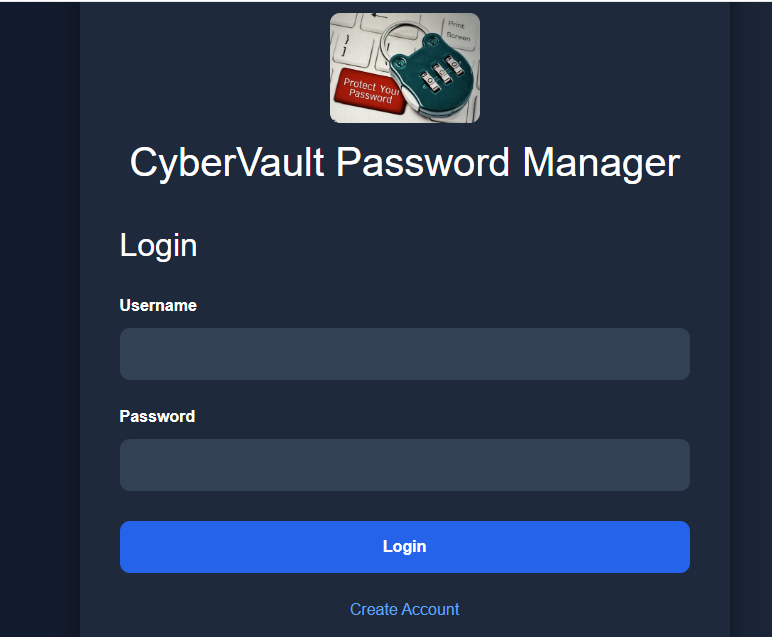
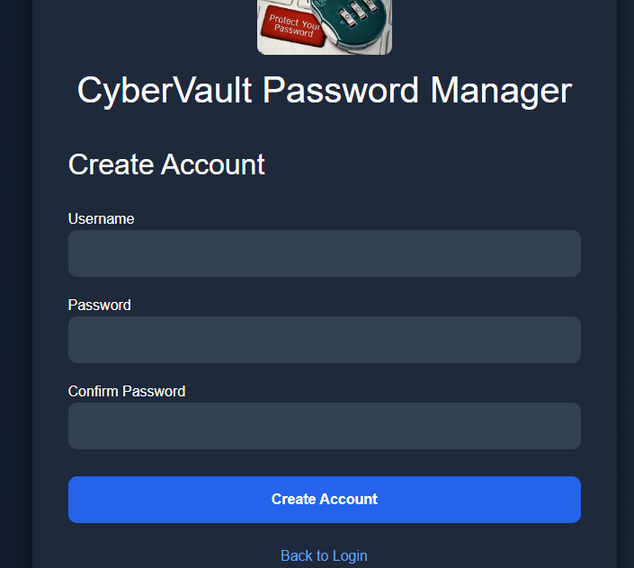
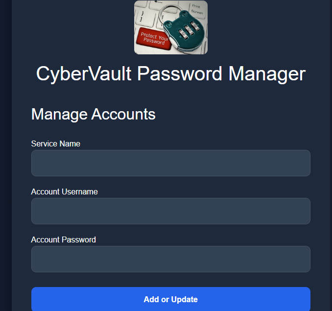
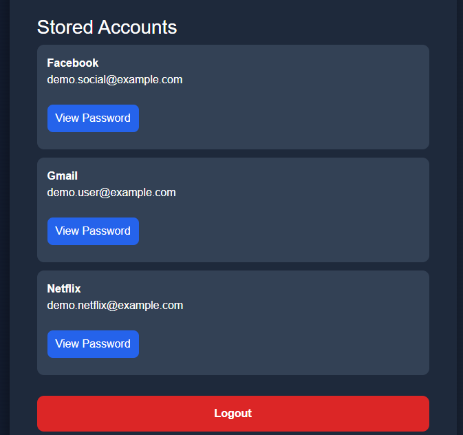
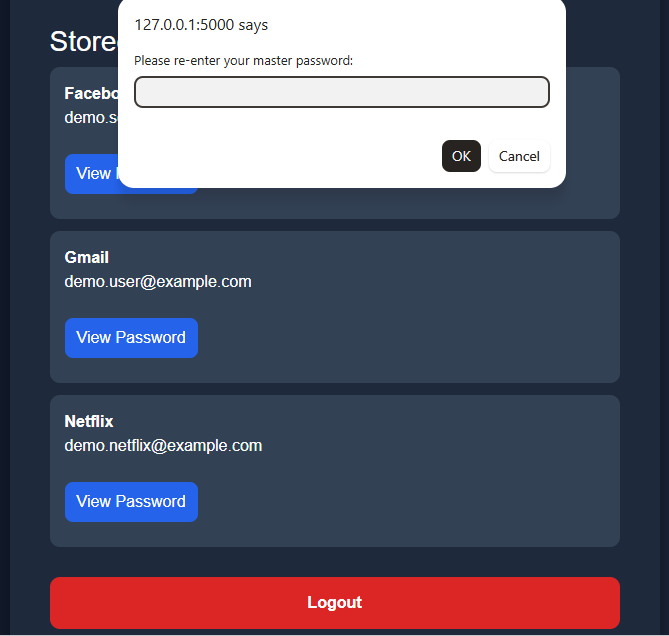

**# CyberVault Password Manager**


A security-focused password management web application built with Python, Flask, and MySQL. CyberVault was developed as an academic cybersecurity project to demonstrate secure authentication, credential protection, session management, input validation, and defensive web application security practices.


**## Project Overview**


CyberVault allows authenticated users to securely store and manage credentials for different online services.


The application separates the user's master password from the credentials stored inside the vault. Master passwords are securely hashed, while stored account passwords are encrypted before being written to the database.


The project was designed with security controls throughout the application rather than treating security as an afterthought.


**## Key Features**


\- User account registration and authentication

\- Master password hashing using bcrypt

\- Encrypted storage of account passwords using Fernet

\- MySQL database integration

\- CSRF protection for forms and protected requests

\- Session management and session expiration

\- Master password reauthentication before retrieving stored passwords

\- Password complexity validation

\- Rate limiting for application endpoints

\- Security headers

\- Environment-based configuration using `.env`

\- Protected database credentials

\- Security logging

\- Account creation and update functionality

\- Secure password retrieval workflow


**## Security Controls**


\### Password Hashing


User master passwords are hashed using bcrypt rather than stored as plaintext.


\### Credential Encryption


Passwords belonging to stored accounts are encrypted using Fernet before being stored in MySQL.


The database therefore does not contain the stored account passwords in readable plaintext.


\### Reauthentication


CyberVault requires the user to re-enter their master password before a stored password can be retrieved.


This provides an additional security layer after the user has already authenticated to the application.


\### CSRF Protection


Flask-WTF is used to protect forms and sensitive POST requests against Cross-Site Request Forgery (CSRF).


The password retrieval workflow also includes the CSRF token when communicating with protected Flask endpoints.


\### Session Security


The application uses Flask-Session for session management and includes session expiration controls to reduce the risk associated with unattended authenticated sessions.


\### Rate Limiting


Flask-Limiter is used to restrict repeated requests and reduce the risk of automated abuse against application endpoints.


\### Security Headers


Flask-Talisman is used to apply security-related HTTP response headers.


\### Environment Variables


Sensitive configuration values are stored in a `.env` file rather than directly inside the source code.


The `.env` file is excluded from Git using `.gitignore`.


**## Technology Stack**


\### Backend


\- Python

\- Flask

\- MySQL

\- Flask-Session

\- Flask-WTF

\- Flask-Limiter

\- Flask-Talisman


\### Security


\- bcrypt

\- cryptography / Fernet

\- CSRF protection

\- Session management

\- Rate limiting

\- Security headers

\- Environment-based secrets management


\### Frontend


\- HTML

\- CSS

\- JavaScript

\- Bootstrap


**## Application Workflow**


```

User

&#x20; |

&#x20; v

Login

&#x20; |

&#x20; v

Master Password Verification

&#x20; |

&#x20; v

Authenticated Session

&#x20; |

&#x20; v

CyberVault Dashboard

&#x20; |

&#x20; +------> Add / Update Account

&#x20; |

&#x20; +------> View Stored Accounts

&#x20; |

&#x20; +------> Re-enter Master Password

&#x20;                   |

&#x20;                   v

&#x20;            Retrieve Encrypted Credential

&#x20;                   |

&#x20;                   v

&#x20;            Decrypt Credential

&#x20;                   |

&#x20;                   v

&#x20;            Display Password

```


## Application Screenshots

### Login



### Create Account



### Manage Accounts



### Stored Accounts



### Master Password Reauthentication




**## Database Security**


CyberVault uses MySQL to store application data.


Stored account passwords are encrypted before being written to the database.


Example database value:


```

gAAAAAB...

```


rather than a plaintext password.


This demonstrates the difference between storing sensitive credentials directly and protecting them through encryption.


**## Testing and Validation**


The application was tested through both functional and security-focused testing.


Testing included:


\- Successful user registration

\- Successful login

\- Rejection of incorrect login credentials

\- Password complexity validation

\- Password confirmation validation

\- Session expiration testing

\- Account creation

\- Account updates

\- Encrypted credential storage

\- Password retrieval after reauthentication

\- CSRF protection

\- Logout functionality

\- Protected access to authenticated application functions


The final testing phase confirmed that the primary authentication, account management, encryption, and password retrieval workflows were functioning as intended.


**## Project Structure**


CyberVault-Password-Manager/

│

├── passwordmanager.py

├── requirements.txt

├── .gitignore

│

├── static/

│   └── logo.png

│

└── templates/

&#x20;   └── index.html


Sensitive local files such as `.env`, security logs, and session data are intentionally excluded from the repository through `.gitignore`.


**## Installation and Setup**


\### 1. Clone the repository


```

git clone https://github.com/Shemab1273/CyberVault-Password-Manager.git

cd CyberVault-Password-Manager

```


\### 2. Create a virtual environment


```

python -m venv venv

```


Activate it on Windows:


```

venv\\Scripts\\activate

```


\### 3. Install dependencies


```

pip install -r requirements.txt

```


\### 4. Configure environment variables


Create a local `.env` file containing the application's required configuration values.


Do not commit the `.env` file to GitHub.


\### 5. Configure MySQL


Create the required MySQL database and tables using the database structure required by the application.


Update the local `.env` configuration with the appropriate database connection information.


\### 6. Run CyberVault


```

python passwordmanager.py

```


The application can then be accessed through the local Flask development server.


**## Security Considerations**


CyberVault is an academic and portfolio project designed to demonstrate cybersecurity concepts and secure application development practices.


It should not be considered a production-ready commercial password manager without additional security review, threat modeling, penetration testing, key management improvements, deployment hardening, and independent security auditing.


**## Future Improvements**


Potential future enhancements include:


\- Multi-factor authentication

\- Password generator

\- Password strength assessment

\- Improved audit logging

\- Automated security testing

\- Expanded automated test coverage

\- Production database configuration

\- Improved encryption key management

\- Secure deployment configuration

\- Additional account management capabilities


**## What I Learned**


This project provided hands-on experience applying cybersecurity principles during application development.


Key areas included:


\- Secure authentication

\- Password hashing

\- Encryption

\- Database security

\- CSRF protection

\- Session management

\- Rate limiting

\- Secure configuration management

\- Defensive web application development

\- Functional and security testing

\- Git and GitHub version control


**## Authors**


\*\*Shema Barrett, Andrea Camaratta, Ben Perez, Cj Clark, Kameron Kinsman, Logan Connelly, Nate Ford\*\*    


IT Security Risk Management Students


This project was developed as part of our cybersecurity and information technology portfolio.


